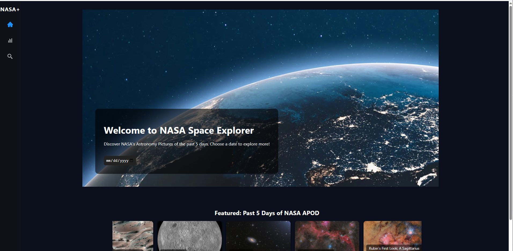
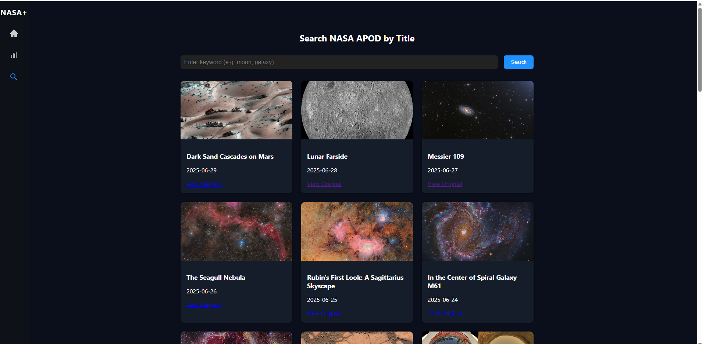
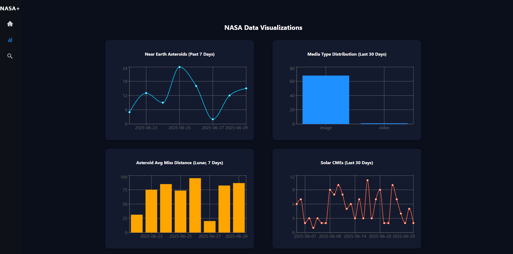

#  NASA Space Explorer

An interactive web app to explore NASA's Astronomy Picture of the Day (APOD) and visualize real-time data from space APIs like near-Earth asteroids and solar CMEs.

## Features

- Browse NASA APOD images from the past 30 days
- Search APODs by title keywords
- View detailed media type statistics
- Track near-Earth asteroid counts and average miss distances
- Visualize solar activity (CMEs) trends
- Fully responsive and mobile-friendly design
- Built using React.js + Recharts + NASA APIs

## Screenshots

### Homepage

### Search Functionality

### Data Visualizations

## 🛠 Tech Stack

### Frontend
- **React.js** (via Create React App)
- **CSS Modules** for component styling
- **Recharts** for all data visualizations

### Backend
- **Node.js + Express**
- Acts as a proxy and formatter for NASA public APIs
- Handles multi-date queries (e.g. APOD Range)

### APIs Used
- [NASA APOD (Astronomy Picture of the Day)](https://api.nasa.gov/)
- [NASA Asteroids - NeoWs](https://api.nasa.gov/)
- [NASA DONKI (Space Weather Events)](https://api.nasa.gov/)

## Live Domain

- https://nasa-space-explorer-nu.vercel.app/
